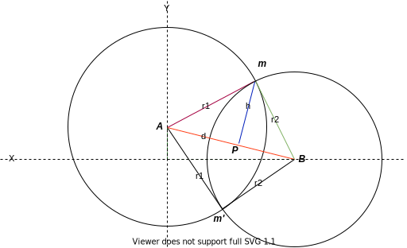

To access to Swagger OpenApi documentation check `http://localhost:8080/swagger-ui.html`

# Architecture of the project

- RestHandlerException layer
- Logger layer
- Controller layer
- Service layer

---

# Technical Details about the implementation logic

Given two circles and his radius (provided by API, understanding a circle as an Satellite with Radius Zn),
It's computed the intersections points of that circles. Understanding a intersection between circles when
choke in almost one point in common in Cartesian plane.

Considering this case, the "Operacion fuego Quasar" can be saw as the Intersection between Circle's A, B and C, if exists.
If A and B have intersection's, that intersections it's checked between C. If coincide the distance between that point and
provided C Radii, then we got a solution.

References:
- Intersection of two circles by Paul Bourke.
- Circle-Circle-Intersection by Lanchon

Comments:
- Drawio diagrams
